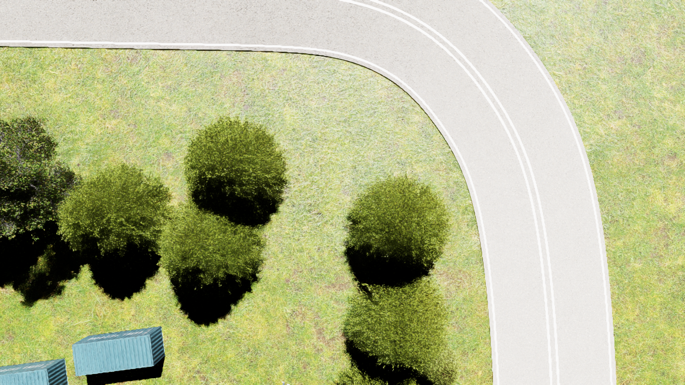
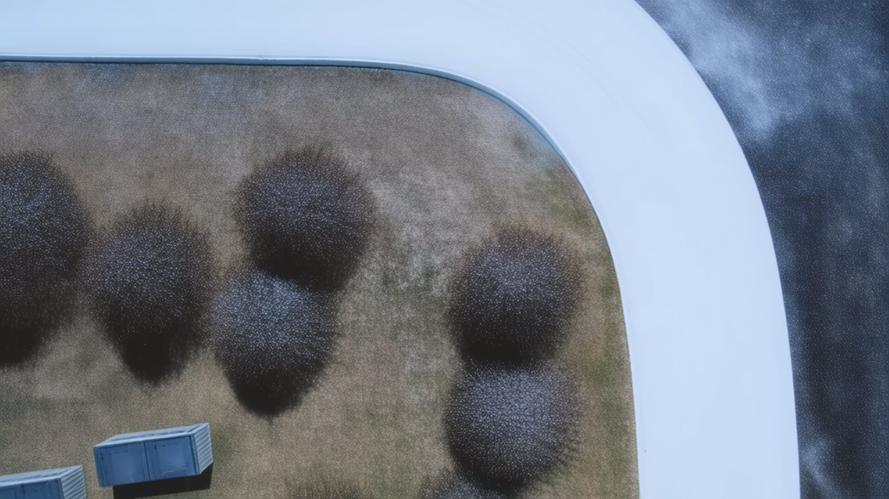
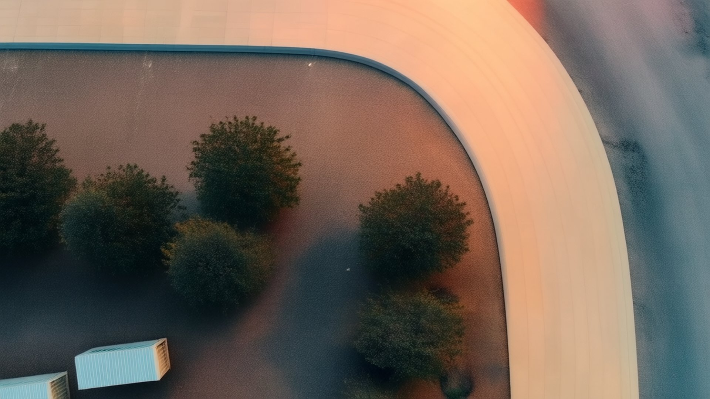
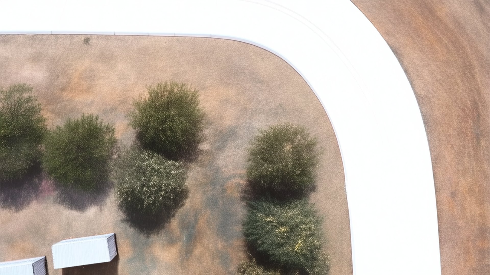
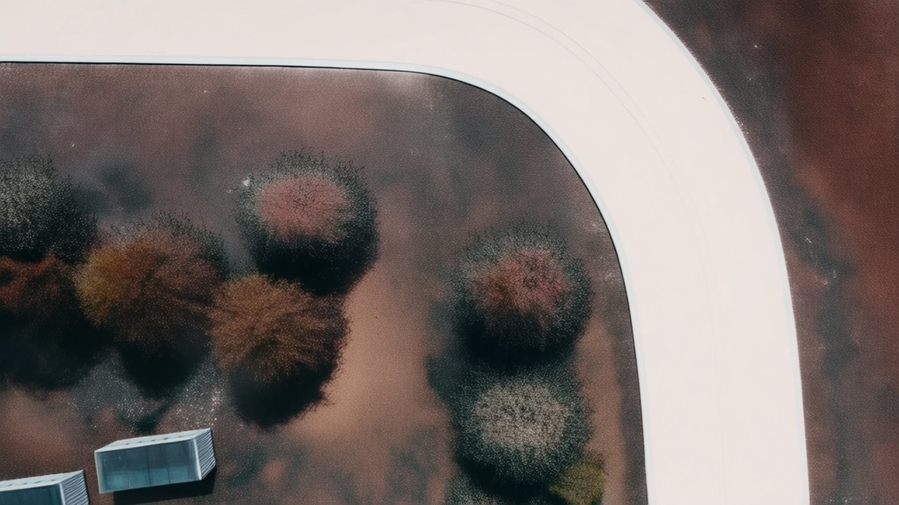

# cosmos_augmentor

`cosmos_augmentor` is a data augmentation tool for semantic segmentation datasets generated with Isaac Sim. It uses NVIDIA Cosmos-Transfer2.5 to create new photorealistic variants of synthetic scenes while preserving the original semantic labels required for training segmentation models.

The repository takes an existing dataset of RGB images and semantic labels, optionally enriches the generation with structured control inputs such as segmentation, depth, and edges, and produces new augmented images driven by text prompts. This makes it possible to expand the visual diversity of a synthetic dataset without rebuilding scenes manually in the simulator.

## Documentation

- [Installation](documentation/Install.md)
- [Configuration Reference](documentation/Config.md)
- [Practical Recommendations](documentation/Recommendations.md)

## What This Repository Provides

- Prompt-based augmentation of Isaac Sim semantic segmentation datasets
- Support for `seg`, `depth`, and `edge` control modalities
- Independent configuration of each control as `disabled`, `external`, or `on_the_fly`
- Preservation of semantic labels in the generated dataset outputs
- Output dataset merging so the final dataset contains both original and augmented samples

## Quick Start

Run the full pipeline, including augmentation and final merge:

```bash
python -m cosmos_augmentor.cli --config config/augmentations.yaml run-all
```

Run only the augmentation stage:

```bash
python -m cosmos_augmentor.cli --config config/augmentations.yaml run-augmentations
```

Run only the final merge stage:

```bash
python -m cosmos_augmentor.cli --config config/augmentations.yaml merge
```

## Examples

The following example uses `orig1.png` and its generated variants stored in `documentation_media/`.

### Original image



**Snow augmentation**

**Prompt example**

> A photorealistic low-altitude top-down view of an outdoor area, seen from a camera looking straight down while moving smoothly forward. A lightly snow-covered environment with a natural winter atmosphere.



**Sunset augmentation**

**Prompt example**

> A photorealistic low-altitude top-down view of an outdoor area, seen from a camera looking straight down while moving smoothly forward. Warm late-afternoon warm light, softer shadows, and a natural sunset atmosphere across the scene.



**Dry augmentation**

**Prompt example**

> A photorealistic low-altitude top-down view of an outdoor area, seen from a camera looking straight down while moving smoothly forward. A very dry environment with a dry-season appearance, sun-exposed ground, and a naturally dry atmosphere.



**Warm augmentation**

**Prompt example**

> A photorealistic low-altitude top-down view of an outdoor area, seen from a camera looking straight down while moving smoothly forward. A war-affected environment with burned and blackened areas on the ground and a harsh conflict-zone atmosphere.



## Output Structure

Each augmentation writes its generated images into its own output directory. After the merge step, the final dataset is stored under `complete_dataset/`, combining:

- Original images
- Original labels
- Augmented images
- The corresponding segmentation labels for every generated image

## Notes

- This project is designed around image-based augmentation workflows, where `max_frames = 1` and `num_video_frames_per_chunk = 1`.
- External controls are only required when the corresponding modality is configured as `external`.
- Depth controls are adapted internally so they match the depth convention expected by Cosmos.
